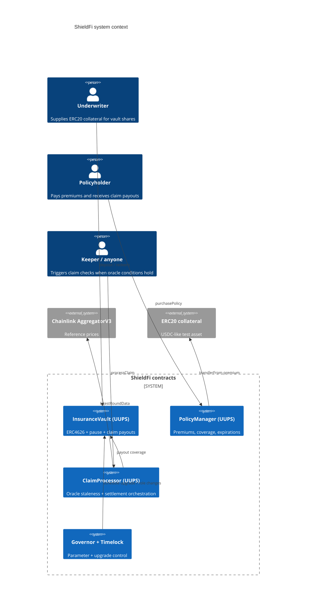
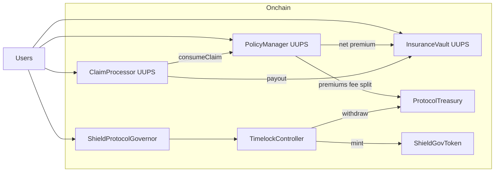
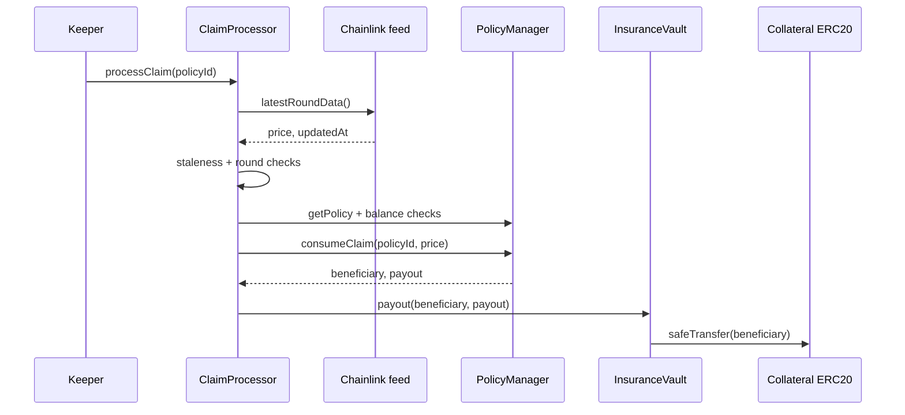

# ShieldFi architecture

ShieldFi is a modular Arbitrum-oriented insurance stack: an ERC4626 underwriting vault absorbs premium inflows as implicit yield, a policy registry prices parametric coverage, a Chainlink-aware claim processor settles payouts under strict CEI ordering, and a timelocked DAO controls minting, upgrades, and treasury outflows.

## C4 context (Mermaid)

## Container view

## Sequence: claim settlement (happy path)

## Storage layout (UUPS core)

Upgradeable contracts follow OpenZeppelin namespaced ERC4626 storage plus append-only variables:

- `InsuranceVault`: OZ ERC4626 storage namespace + `totalPayouts` + `uint256[50] __gap`.
- `InsuranceVaultV2`: appends `protocolFeeBps` after parent layout (never reorder inherited slots).

Full storage dumps should be regenerated with `forge inspect <Contract> storageLayout` after each release and archived under `docs/storage-layouts/`.

## Trust assumptions

1. **Timelock + Governor** are the ultimate administrators for upgrades, role grants, and treasury withdrawals.
2. **Chainlink feeds** are correct on average but can be stale or manipulated over short horizons; the processor enforces heartbeat and positive-answer checks, not L2 sequencer uptime (add for production mainnet L2).
3. **Collateral ERC20** is non-rebasing, non-fee-on-transfer; fee-on-transfer assets require a different deposit path.
4. **Underwriters** accept ERC4626 donation/inflation risks mitigated by OZ virtual offsets and seed deposits.

## Architectural decision records (ADR)

| ADR | Decision | Rationale |
| --- | --- | --- |
| ADR-001 | UUPS for vault/policy/claim | Gas-efficient upgrades with strict `onlyRole` authorization on `_authorizeUpgrade`. |
| ADR-002 | External ClaimProcessor | Isolates oracle parsing + reentrancy surface; policy state transitions stay in one module. |
| ADR-003 | Premium split to treasury + vault | Satisfies “treasury only timelock” while letting LPs absorb yield via idle balance growth. |
| ADR-004 | Block-based Governor timing | Matches ERC20Votes default clock; deployment script encodes Arbitrum-approximate block windows. |
| ADR-005 | Intentional vulnerable contracts isolated | Pedagogical reentrancy/access flaws live under `contracts/lessons/vulnerable` and are excluded from the primary Slither gate. |

## Assignment coverage map

| Requirement | Implementation |
| --- | --- |
| ERC20Votes + Permit governance | `ShieldGovToken.sol` |
| ERC4626 vault + pause + payouts | `InsuranceVault.sol` |
| Policy lifecycle + premiums | `PolicyManager.sol` |
| Oracle claims + CEI + ReentrancyGuard | `ClaimProcessor.sol` + `PolicyManager.consumeClaim` |
| Governor + timelock + treasury isolation | `ShieldProtocolGovernor.sol`, `ProtocolTreasury.sol` |
| Chainlink staleness + mock | `ClaimProcessor.sol`, `MockAggregatorV3.sol` |
| CREATE + CREATE2 factory | `PoolFactory.sol` |
| UUPS V1/V2 | `InsuranceVault.sol`, `InsuranceVaultV2.sol` |
| Yul gas benchmark | `GasOptimizedMath.sol` + `SuiteA.t.sol` |
| Vulnerable + fixed + tests | `contracts/lessons/*`, `Lessons.t.sol` |
